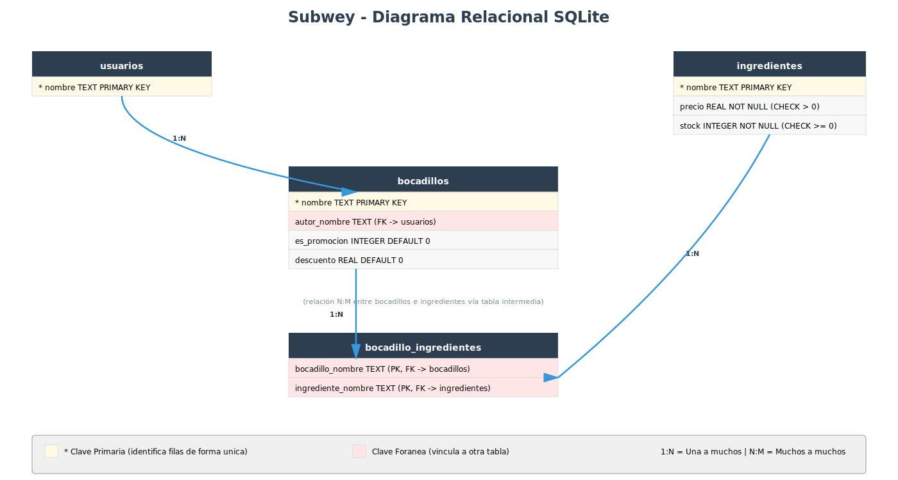

# Diseño de tablas SQLite para Sistema Subwey

**Nota:** Este documento es una **guía de referencia** que parte del diseño de base de datos que **ya habías implementado** en tu proyecto. No describe cómo deberías hacerlo desde cero, sino que documenta y explica el esquema SQL que ya tenías creado (script `crear_bd.py`, tablas `ingredientes`, `usuarios`, `bocadillos` y `bocadillo_ingredientes`). Su propósito es servirte como apoyo para entender las decisiones de diseño que tomaste y como base para completar la documentación de la Fase 04 (`docs/DISEÑO_BD.md`).


## Fase 1: Identificar las entidades y sus atributos

El primer paso es hacer un inventario de las clases de tu dominio que almacenan datos. Cada una de estas clases se convertirá en una **tabla** de la base de datos.

Vamos a repasar tus clases y qué atributos de cada una necesitamos guardar:

**Ingrediente** (`domain/ingrediente.py`)

| Atributo | Tipo en Python | Tipo en SQL | Notas |
|---|---|---|---|
| `nombre` | str | TEXT | Identificador único del ingrediente (ej: tomate) |
| `precio` | float | REAL | Precio unitario (validación: > 0) |
| `stock` | int | INTEGER | Unidades disponibles (validación: >= 0) |

**Usuario** (`domain/usuario.py`)

| Atributo | Tipo en Python | Tipo en SQL | Notas |
|---|---|---|---|
| `nombre` | str | TEXT | Identificador único del usuario (default: "Anónimo") |

**Bocadillo** (`domain/bocadillo.py`) — Clase base

| Atributo | Tipo en Python | Tipo en SQL | Notas |
|---|---|---|---|
| `nombre` | str | TEXT | Identificador único del bocadillo |
| `ingredientes` | list[Ingrediente] | (N:M vía tabla intermedia) | Relación con ingredientes |
| `autor` | Usuario | TEXT | FK a `usuarios(nombre)` |
| (discriminador) | — | INTEGER | Columna `es_promocion` para distinguir el tipo de bocadillo |

**BocadilloPromocion** — Hereda de Bocadillo

| Atributo | Tipo en Python | Tipo en SQL | Notas |
|---|---|---|---|
| `descuento` | float | REAL | Porcentaje de descuento (1-90) |


## Fase 2: Conceptos básicos de bases de datos

Antes de avanzar, necesitamos entender algunos conceptos:

### Tabla, fila y columna

Una **tabla** es como un diccionario de Python, pero guardado en disco:
- Cada **fila** es un objeto individual (un ingrediente, un bocadillo, un usuario)
- Cada **columna** es un atributo de ese objeto (el nombre, el precio, el stock, etc.)

**Ejemplo:**
```
Tabla: ingredientes
┌──────────┬────────┬───────┐
│ nombre   │ precio │ stock │
├──────────┼────────┼───────┤
│ tomate   │ 3.00   │ 20    │
│ aguacate │ 7.00   │ 8     │
│ queso    │ 2.00   │ 42    │
└──────────┴────────┴───────┘
```

### Clave primaria (PRIMARY KEY)

Es la columna que **identifica de forma única cada fila**. No puede haber dos filas con el mismo valor en la clave primaria. En tu código:
- Para ingredientes → `nombre` es la clave primaria
- Para usuarios → `nombre` es la clave primaria
- Para bocadillos → `nombre` es la clave primaria

### Clave foránea (FOREIGN KEY)

Es una columna que "apunta" a la clave primaria de **otra tabla**. Sirve para crear vínculos entre tablas y permite que la base de datos garantice que esos vínculos siempre sean válidos.

**Ejemplo:** Un bocadillo tiene un `autor_nombre` que apunta a la clave primaria `nombre` de la tabla `usuarios`. Si intentas guardar un bocadillo con un autor que no existe, la base de datos lo rechazará automáticamente.

En SQLite, para que se apliquen restricciones al usar las claves foráneas lo hacemos con `PRAGMA foreign_keys = ON` al inicio de cada conexión.

### Relaciones entre tablas

Una **relación** describe cómo se vinculan las filas de una tabla A con las filas de otra tabla B. Los tipos más comunes son:

- **Uno a uno (1:1):** Una fila de la tabla A se vincula con exactamente una fila de la tabla B.
  - Ejemplo: un empleado tiene un único correo corporativo; un correo corporativo pertenece a un único empleado.

- **Uno a muchos (1:N):** Una fila de la tabla A se vincula con múltiples filas de la tabla B. Muy común.
  - Ejemplo en tu proyecto: un **usuario** puede crear múltiples **bocadillos**. El usuario "Oficial" puede haber creado los bocadillos "vegetal" y "caprese".

- **Muchos a muchos (N:M):** Una fila de la tabla A se vincula con múltiples filas de la tabla B, y viceversa. Requiere una tabla intermedia.
  - Ejemplo en tu proyecto: un **bocadillo** contiene muchos **ingredientes**, y un **ingrediente** puede estar en muchos **bocadillos**. El ingrediente "tomate" está en "vegetal" y "caprese", y el bocadillo "vegetal" tiene tomate y aguacate.

### Tabla de unión (Junction Table)

Cuando existe una relación **muchos a muchos (N:M)**, usamos una tabla intermedia. **En tu proyecto esto es necesario:** la relación entre bocadillos e ingredientes es N:M, y por eso necesitamos una tabla `bocadillo_ingredientes` que guarde qué ingredientes tiene cada bocadillo.


## Fase 3: Identificar las relaciones entre entidades

Cuando un objeto **"pertenece a"** o **"contiene"** otro, eso se traduce en la base de datos mediante **claves foráneas** (FK).

### Relación uno a muchos (1:N)

**Un usuario crea muchos bocadillos**
- Cada bocadillo tiene un autor (Usuario) en un momento dado
- Usamos la columna `autor_nombre` en la tabla `bocadillos` como clave foránea que apunta a `usuarios(nombre)`
- Esto es simple y directo: no necesitamos tabla intermedia

### Relación muchos a muchos (N:M)

**Un bocadillo contiene muchos ingredientes, y un ingrediente está en muchos bocadillos**
- El bocadillo "vegetal" contiene tomate y aguacate
- El ingrediente "tomate" está en los bocadillos "vegetal" y "caprese"
- Una columna simple en la tabla `bocadillos` no es suficiente porque habría que almacenar múltiples valores
- Solución: tabla intermedia `bocadillo_ingredientes` con dos columnas (bocadillo_nombre, ingrediente_nombre) que forman la clave primaria compuesta

**Ejemplo:**
```
Tabla: bocadillo_ingredientes
┌────────────────────┬────────────────────┐
│ bocadillo_nombre   │ ingrediente_nombre │
├────────────────────┼────────────────────┤
│ vegetal            │ tomate             │
│ vegetal            │ aguacate           │
│ caprese            │ tomate             │
│ caprese            │ queso              │
└────────────────────┴────────────────────┘
```

### Herencia en el dominio

En tu código, `BocadilloPromocion` hereda de `Bocadillo`. En SQL, usamos:

**Tabla única con discriminador** (la opción elegida)
- Una sola tabla `bocadillos` con columnas `es_promocion` (0 o 1) y `descuento` (porcentaje)
- Más simple que dividir en varias tablas
- Evita uniones (joins) complicadas
- Si `es_promocion = 1`, el bocadillo es un `BocadilloPromocion` y tiene un descuento válido; si `es_promocion = 0`, es un `Bocadillo` normal y descuento puede ser 0


## Fase 4: Diseño de las tablas

### Tabla `ingredientes` — Los ingredientes disponibles

Almacena cada ingrediente que puede formar parte de un bocadillo.

| Columna | Tipo | Notas |
|---|---|---|
| `nombre` | TEXT | Clave primaria: identificador único (ej: tomate) |
| `precio` | REAL | Precio unitario (CHECK: > 0) |
| `stock` | INTEGER | Unidades disponibles (CHECK: >= 0) |

**¿Por qué estas columnas?** Cada atributo de la clase `Ingrediente` se convierte en una columna.


### Tabla `usuarios` — Los usuarios del sistema

Almacena los usuarios que pueden crear bocadillos.

| Columna | Tipo | Notas |
|---|---|---|
| `nombre` | TEXT | Clave primaria: identificador único (ej: Anónimo, Oficial) |

**¿Por qué una única columna?** La clase `Usuario` solo tiene un atributo (nombre).


### Tabla `bocadillos` — Los bocadillos

Almacena todos los bocadillos del sistema, ya sean normales o promocionales.

| Columna | Tipo | Notas |
|---|---|---|
| `nombre` | TEXT | Clave primaria: identificador único del bocadillo (ej: vegetal) |
| `autor_nombre` | TEXT | Clave foránea → `usuarios(nombre)`. Autor del bocadillo |
| `es_promocion` | INTEGER | Discriminador: 0 = Bocadillo normal, 1 = BocadilloPromocion |
| `descuento` | REAL | Porcentaje de descuento (0 si es normal, 1-90 si es promoción) |

**¿Por qué `es_promocion` es necesario?** Aunque `BocadilloPromocion` hereda de `Bocadillo`, en SQL usamos una sola tabla. La columna `es_promocion` indica si el bocadillo es promocional, para poder reconstruir el objeto correcto cuando lo recuperes.

**¿Por qué `descuento` existe también para bocadillos normales?** Porque SQL exige que todas las filas tengan las mismas columnas. Para un `Bocadillo` normal, `descuento` valdrá 0 y no se usará.


### Tabla `bocadillo_ingredientes` — Los ingredientes de cada bocadillo

Registra qué ingredientes forman parte de cada bocadillo. Es una **tabla de unión (junction table)** que implementa la relación N:M entre bocadillos e ingredientes. Responde preguntas como: "¿Qué ingredientes tiene el bocadillo vegetal?" o "¿En qué bocadillos aparece el tomate?".

| Columna | Tipo | Notas |
|---|---|---|
| `bocadillo_nombre` | TEXT | Clave foránea → `bocadillos(nombre)` (parte de PK compuesta) |
| `ingrediente_nombre` | TEXT | Clave foránea → `ingredientes(nombre)` (parte de PK compuesta) |

**¿Por qué clave primaria compuesta?** Porque lo que identifica de forma única una fila es la combinación de (bocadillo_nombre, ingrediente_nombre). La misma pareja no puede aparecer dos veces (un bocadillo no puede tener el mismo ingrediente dos veces).

### Diagrama relacional resultante

Con el diseño de tablas descrito arriba, el esquema de la base de datos queda así:



El diagrama muestra las 4 tablas del sistema y sus relaciones:
- **usuarios → bocadillos** (1:N): un usuario puede crear muchos bocadillos
- **bocadillos ↔ ingredientes** (N:M, vía `bocadillo_ingredientes`): un bocadillo contiene muchos ingredientes y un ingrediente aparece en muchos bocadillos


## Fase 5: SQL de creación

Aquí tienes el SQL completo para crear todas las tablas. **El orden importa:** las tablas que son referenciadas por otras (con claves foráneas) deben crearse primero.

```sql
PRAGMA foreign_keys = ON;

-- 1. Crear tabla de ingredientes (no depende de ninguna otra tabla)
CREATE TABLE IF NOT EXISTS ingredientes (
    nombre TEXT PRIMARY KEY,
    precio REAL NOT NULL CHECK (precio > 0),
    stock INTEGER NOT NULL CHECK (stock >= 0)
);

-- 2. Crear tabla de usuarios (no depende de ninguna otra tabla)
CREATE TABLE IF NOT EXISTS usuarios (
    nombre TEXT PRIMARY KEY
);

-- 3. Crear tabla de bocadillos (depende de usuarios para la FK de autor)
CREATE TABLE IF NOT EXISTS bocadillos (
    nombre TEXT PRIMARY KEY,
    autor_nombre TEXT NOT NULL,
    es_promocion INTEGER DEFAULT 0,
    descuento REAL DEFAULT 0,
    FOREIGN KEY (autor_nombre) REFERENCES usuarios(nombre)
);

-- 4. Crear tabla intermedia (depende de bocadillos e ingredientes)
CREATE TABLE IF NOT EXISTS bocadillo_ingredientes (
    bocadillo_nombre TEXT,
    ingrediente_nombre TEXT,
    PRIMARY KEY (bocadillo_nombre, ingrediente_nombre),
    FOREIGN KEY (bocadillo_nombre) REFERENCES bocadillos(nombre),
    FOREIGN KEY (ingrediente_nombre) REFERENCES ingredientes(nombre)
);
```

**Explicación del orden:**
1. **ingredientes** y **usuarios** se crean primero porque no tienen claves foráneas
2. **bocadillos** se crea después porque necesita que usuarios ya exista
3. **bocadillo_ingredientes** se crea al final porque necesita que bocadillos e ingredientes existan


## Fase 6: Script de ejemplo para crear la base de datos

Este script Python crea la base de datos con todas las tablas e inserta datos iniciales de prueba.

```python
"""Script para crear la base de datos de Subwey con datos iniciales."""

import sqlite3
from pathlib import Path

# Eliminar la base de datos si ya existe (para recrearla limpia)
ruta_bd = Path("subway.db")
if ruta_bd.exists():
    ruta_bd.unlink()

conn = sqlite3.connect("subway.db")
cursor = conn.cursor()
cursor.execute("PRAGMA foreign_keys = ON")

# Crear tablas (en el orden correcto: sin dependencias primero, luego con dependencias)
cursor.executescript("""
PRAGMA foreign_keys = ON;

CREATE TABLE IF NOT EXISTS ingredientes (
    nombre TEXT PRIMARY KEY,
    precio REAL NOT NULL CHECK (precio > 0),
    stock INTEGER NOT NULL CHECK (stock >= 0)
);

CREATE TABLE IF NOT EXISTS usuarios (
    nombre TEXT PRIMARY KEY
);

CREATE TABLE IF NOT EXISTS bocadillos (
    nombre TEXT PRIMARY KEY,
    autor_nombre TEXT NOT NULL,
    es_promocion INTEGER DEFAULT 0,
    descuento REAL DEFAULT 0,
    FOREIGN KEY (autor_nombre) REFERENCES usuarios(nombre)
);

CREATE TABLE IF NOT EXISTS bocadillo_ingredientes (
    bocadillo_nombre TEXT,
    ingrediente_nombre TEXT,
    PRIMARY KEY (bocadillo_nombre, ingrediente_nombre),
    FOREIGN KEY (bocadillo_nombre) REFERENCES bocadillos(nombre),
    FOREIGN KEY (ingrediente_nombre) REFERENCES ingredientes(nombre)
);
""")

# Insertar datos iniciales

# 1. Crear ingredientes
cursor.execute("INSERT INTO ingredientes (nombre, precio, stock) VALUES ('tomate', 3.00, 20)")
cursor.execute("INSERT INTO ingredientes (nombre, precio, stock) VALUES ('aguacate', 7.00, 8)")
cursor.execute("INSERT INTO ingredientes (nombre, precio, stock) VALUES ('queso', 2.00, 42)")

# 2. Crear usuarios
cursor.execute("INSERT INTO usuarios (nombre) VALUES ('Anónimo')")
cursor.execute("INSERT INTO usuarios (nombre) VALUES ('Oficial')")
cursor.execute("INSERT INTO usuarios (nombre) VALUES ('usuario_test')")

# 3. Crear bocadillos (bocadillos normales; usa es_promocion=1 y descuento > 0 para crear promociones)
cursor.execute("""
    INSERT INTO bocadillos (nombre, autor_nombre, es_promocion, descuento)
    VALUES ('vegetal', 'Anónimo', 0, 0)
""")
cursor.execute("""
    INSERT INTO bocadillos (nombre, autor_nombre, es_promocion, descuento)
    VALUES ('caprese', 'Anónimo', 0, 0)
""")

# 4. Registrar ingredientes de cada bocadillo (relación N:M)
cursor.execute("INSERT INTO bocadillo_ingredientes VALUES ('vegetal', 'tomate')")
cursor.execute("INSERT INTO bocadillo_ingredientes VALUES ('vegetal', 'aguacate')")
cursor.execute("INSERT INTO bocadillo_ingredientes VALUES ('caprese', 'tomate')")
cursor.execute("INSERT INTO bocadillo_ingredientes VALUES ('caprese', 'queso')")

conn.commit()
conn.close()

print("Base de datos creada en: subway.db")
```

**Características importantes:**
- Elimina la BD existente para recrearla limpia (idempotente)
- Crea las tablas en el orden correcto
- Inserta datos de ejemplo que puedes usar para probar
- Activa integridad referencial con `PRAGMA foreign_keys = ON`


## Fase 7: Ejemplo de implementación del repositorio SQLite

Aquí tienes un ejemplo de cómo implementaría uno de tus repositorios usando SQLite.

**Nota sobre el código de tus repositorios actuales:** Tu `RepositorioBocadillo` ya tiene una implementación funcional, pero con algunas diferencias respecto a este ejemplo:
- Tu método `guardar(self, nombre, ingredientes, descuento=None, autor=None)` recibe los datos sueltos; el ejemplo de abajo recibe el objeto `bocadillo` completo ya construido. Es una pequeña mejora de diseño orientada a objetos: la capa de servicio construye el `Bocadillo`/`BocadilloPromocion` y lo pasa al repositorio.
- Tu repositorio lanza `ValueError` genéricos; este ejemplo los transforma en excepciones de dominio específicas (`BocadilloYaExisteError`, etc.).

Cuando apliques los cambios, puedes elegir mantener tu firma actual de `guardar()` y centrarte únicamente en migrar de `ValueError` a excepciones de dominio, o evolucionar a un diseño más OO como el del ejemplo. Ambas opciones son válidas para la Fase 04.

**Importante:** Este ejemplo asume que ya has creado las **excepciones de dominio** en `infrastructure/errores.py` (ver "Excepciones de dominio para persistencia" en la checklist de la Fase 04). Si aún no las has creado, debes hacerlo primero. Las excepciones necesarias son:

```python
class ErrorRepositorio(Exception):
    """Clase base para todas las excepciones del repositorio."""
    pass

class BocadilloYaExisteError(ErrorRepositorio):
    """Se lanza cuando se intenta guardar un bocadillo con nombre duplicado."""
    pass

class BocadilloNoEncontradoError(ErrorRepositorio):
    """Se lanza cuando se intenta recuperar un bocadillo inexistente."""
    pass

class IngredienteNoEncontradoError(ErrorRepositorio):
    """Se lanza cuando un ingrediente referenciado no existe."""
    pass

class ErrorPersistencia(ErrorRepositorio):
    """Se lanza para errores inesperados de la base de datos."""
    pass
```

**Ejemplo para `RepositorioBocadillo` — Método `guardar()`:**

```python
import sqlite3
from Subwey.infrastructure.errores import BocadilloYaExisteError, ErrorPersistencia


class RepositorioBocadilloSQLite:
    def __init__(self, ruta_bd="subway.db"):
        self._ruta_bd = ruta_bd

    def guardar(self, bocadillo):
        """Guarda un nuevo bocadillo en la base de datos."""
        conn = sqlite3.connect(self._ruta_bd)
        try:
            with conn:
                cursor = conn.cursor()
                cursor.execute("PRAGMA foreign_keys = ON")

                # Discriminador y valor del descuento
                if bocadillo.es_promocional():
                    es_promocion = 1
                    descuento = bocadillo.descuento  # solo existe en BocadilloPromocion
                else:
                    es_promocion = 0
                    descuento = 0

                # Insertar en tabla bocadillos
                cursor.execute(
                    """INSERT INTO bocadillos
                       (nombre, autor_nombre, es_promocion, descuento)
                       VALUES (?, ?, ?, ?)""",
                    (bocadillo.nombre,
                     bocadillo.autor.nombre,  # autor es un Usuario; .nombre es su atributo público
                     es_promocion,
                     descuento),
                )

                # Insertar relaciones N:M en la tabla intermedia
                for ingrediente in bocadillo.ingredientes:
                    cursor.execute(
                        """INSERT INTO bocadillo_ingredientes
                           (bocadillo_nombre, ingrediente_nombre)
                           VALUES (?, ?)""",
                        (bocadillo.nombre, ingrediente.nombre),
                    )
        except sqlite3.IntegrityError as e:
            # IntegrityError → violación de PRIMARY KEY (nombre duplicado)
            raise BocadilloYaExisteError(
                f"Ya existe un bocadillo con nombre '{bocadillo.nombre}'"
            ) from e
        except sqlite3.OperationalError as e:
            # OperationalError → problema técnico (conexión, sintaxis, permisos)
            raise ErrorPersistencia(f"Error al guardar el bocadillo: {e}") from e
        finally:
            conn.close()
```

**Explicación línea por línea:**
1. Abre conexión a la BD: `conn = sqlite3.connect(self._ruta_bd)`
2. Activa integridad referencial: `cursor.execute("PRAGMA foreign_keys = ON")`
3. Determina si es promocional y calcula el descuento
4. Usa `?` en la consulta SQL para parámetros (previene inyección SQL)
5. Inserta en la tabla `bocadillos` con el discriminador `es_promocion`
6. Inserta en la tabla intermedia `bocadillo_ingredientes` una fila por cada ingrediente
7. Si hay un `IntegrityError` (clave primaria duplicada), transforma a `BocadilloYaExisteError`
8. Si hay otro error técnico, transforma a `ErrorPersistencia`
9. Cierra la conexión siempre (en el `finally`)

**Ejemplo para `RepositorioBocadillo` — Método `obtener_por_nombre()`:**

Al recuperar un bocadillo, necesitamos reconstruir también sus ingredientes (que están en otra tabla vía la tabla intermedia). Para ello, este ejemplo recibe el repositorio de ingredientes como parámetro en el constructor (inyección de dependencias), y lo usa cuando lo necesita.

```python
import sqlite3
from Subwey.infrastructure.errores import (
    BocadilloYaExisteError,
    BocadilloNoEncontradoError,
    ErrorPersistencia,
)
from Subwey.domain.bocadillo import Bocadillo, BocadilloPromocion
from Subwey.domain.usuario import Usuario


class RepositorioBocadilloSQLite:
    def __init__(self, ruta_bd="subway.db", repo_ingredientes=None):
        self._ruta_bd = ruta_bd
        self._repo_ingredientes = repo_ingredientes

    # ... método guardar() (visto arriba) ...

    def obtener_por_nombre(self, nombre):
        """Recupera un bocadillo por su nombre."""
        conn = sqlite3.connect(self._ruta_bd)
        try:
            cursor = conn.cursor()
            cursor.execute("PRAGMA foreign_keys = ON")

            # Obtener datos del bocadillo
            cursor.execute(
                """SELECT nombre, autor_nombre, es_promocion, descuento
                   FROM bocadillos WHERE nombre = ?""",
                (nombre,)
            )
            fila = cursor.fetchone()
            if fila is None:
                raise BocadilloNoEncontradoError(
                    f"No existe bocadillo con nombre '{nombre}'"
                )
            nombre_b, autor_nombre, es_promocion, descuento = fila

            # Obtener los nombres de ingredientes del bocadillo (desde la tabla intermedia)
            cursor.execute(
                """SELECT ingrediente_nombre FROM bocadillo_ingredientes
                   WHERE bocadillo_nombre = ?""",
                (nombre_b,)
            )
            nombres_ingredientes = [row[0] for row in cursor.fetchall()]

            # Reconstruir los objetos Ingrediente usando el repositorio de ingredientes
            ingredientes = [
                self._repo_ingredientes.obtener_por_nombre(nom)
                for nom in nombres_ingredientes
            ]

            # Reconstruir el bocadillo del tipo correcto según el discriminador
            autor = Usuario(autor_nombre)
            if es_promocion == 1:
                # El constructor es: BocadilloPromocion(nombre, ingredientes, descuento_porcentaje=10, autor=None)
                return BocadilloPromocion(nombre_b, ingredientes, descuento, autor)
            else:
                return Bocadillo(nombre_b, ingredientes, autor)
        except sqlite3.OperationalError as e:
            raise ErrorPersistencia(f"Error al obtener el bocadillo: {e}") from e
        finally:
            conn.close()
```

**Puntos clave de ambos métodos:**
- Siempre activa `PRAGMA foreign_keys = ON` para garantizar integridad referencial
- Usa parámetros `?` en lugar de concatenar strings (previene inyección SQL)
- Transforma excepciones técnicas de SQLite en excepciones de dominio
- Para relaciones N:M, el guardar y el obtener requieren **dos consultas**: una a la tabla principal y otra a la tabla intermedia
- Usa `es_promocion` como discriminador para reconstruir el objeto correcto (Bocadillo o BocadilloPromocion)


## Resumen: de memoria a SQLite

### Mapeado de conceptos

| Código Python (fase anterior, en memoria) | Base de datos SQLite (fase actual) | Propósito |
|---|---|---|
| `_ingredientes = {}` | Tabla `ingredientes` | Guardar todos los ingredientes persistentemente |
| `_usuarios = {}` | Tabla `usuarios` | Guardar todos los usuarios persistentemente |
| `_bocadillos = {}` | Tabla `bocadillos` (con columna `es_promocion`) | Guardar todos los bocadillos persistentemente |
| `bocadillo.ingredientes` (lista interna) | Tabla `bocadillo_ingredientes` | Saber qué ingredientes tiene cada bocadillo (relación N:M) |

### Beneficios de migrar a SQLite

- **Persistencia:** Los datos no desaparecen al cerrar el programa
- **Integridad referencial:** Las claves foráneas garantizan que no habrá datos rotos (ej: un bocadillo con un ingrediente que no existe)
- **Escalabilidad:** Manejo eficiente de grandes volúmenes de datos
- **Estándar:** SQL es un estándar conocido y usado en la industria
- **Simple:** SQLite no necesita un servidor externo, es un fichero `subway.db`

### Arquitectura en capas (sin cambios en lógica)

```
┌─────────────────────────────────────┐
│  Presentation (menú)                │
│  - No toca datos                    │
└──────────────┬──────────────────────┘
               │ usa
┌──────────────▼──────────────────────┐
│  Application (servicios)            │
│  - ServicioBocadillo                │
│  - ServicioIngrediente              │
│  - Usa repositorios                 │
└──────────────┬──────────────────────┘
               │ usa
┌──────────────▼──────────────────────┐
│  Domain (entidades + contratos)     │
│  - Bocadillo, Ingrediente, Usuario  │
│  - RepositorioBocadillo (contrato)  │
└──────────────┬──────────────────────┘
               │ implementado por
┌──────────────▼──────────────────────┐
│  Infrastructure (implementación)    │
│  - RepositorioBocadilloSQLite       │
│  - Lee/escribe en tablas            │
└─────────────────────────────────────┘
```

**Lo importante:** Domain y Application no cambian. Solo Infrastructure.


## Estado de la Checklist Fase 04 (PD4)

Marcamos con [x] los apartados que **este documento cubre o sirve de referencia** y con [ ] los que todavía son **responsabilidad tuya** dentro de tu proyecto. El estado final de cada [ ] lo determinas cuando lo completes en tu código o documentación.

### Diseño e implementación del esquema de base de datos

- [x] Copiar en `04-sqlite` el estado base de `03-testing` (o crear rama específica para la fase 04) — *Hecho: carpeta `proyecto/04-sqlite/` creada a partir de `03-testing`*
- [x] Diseñar las tablas SQL mapeando cada entidad de dominio a tablas con sus columnas, tipos y restricciones (`PRIMARY KEY`, `NOT NULL`, `FOREIGN KEY`) — **Fases 1-4 de este documento**
- [x] Usar nombres de columnas en snake_case — **Fase 4 de este documento**

### Script de inicialización de base de datos

- [x] Crear script que cree el esquema de la BD e inserte datos iniciales de prueba — **Fase 6 de este documento** (y tu `proyecto/04-sqlite/crear_bd.py`)
  - [x] Debe poder ejecutarse varias veces sin error — **Fase 6** (usa `INSERT OR REPLACE` en tu script)
  - [x] Crea todas las tablas respetando dependencias de claves foráneas — **Fases 5-6**
  - [x] Inserta datos iniciales para probar la aplicación — **Fase 6**

### Excepciones de dominio para persistencia

- [ ] (*opcional*) Crear fichero de excepciones (`infrastructure/errores.py`) con las excepciones que el repositorio SQLite lanza al usuario — **Fase 7 de este documento (código de ejemplo)**
  - [ ] Clase base para todas las excepciones de persistencia — **Fase 7**
  - [ ] Excepciones por cada tipo de error que puede ocurrir (duplicado, no encontrado, etc.) — **Fase 7**

### Implementación del repositorio SQLite

- [x] Crear clase(s) de repositorio que implementen persistencia en SQLite (realizando las mismas operaciones que el repositorio en memoria: guardar, obtener, actualizar, eliminar, etc.) — *Hecho: `RepositorioIngrediente`, `RepositorioBocadillo` y `RepositorioUsuario` en `infrastructure/`*
- [x] Usar consultas SQL parametrizadas (parámetros `?`) para prevenir inyección SQL — *Hecho: todas las consultas usan `?`*
- [ ] (*opcional*) Capturar excepciones SQLite (`sqlite3.IntegrityError`, `sqlite3.OperationalError`, etc.) y transformarlas en excepciones de dominio — **Fase 7** (actualmente lanzas `ValueError` genéricos, conviene migrar a excepciones de dominio)
- [x] Activar `PRAGMA foreign_keys = ON` al conectar para garantizar integridad referencial — *Hecho: `_conectar()` ejecuta `PRAGMA foreign_keys = ON` en los tres repositorios*
- [x] **El flujo principal de la aplicación (menú) debe usar SOLO el repositorio SQLite para persistencia** (no usar en memoria) — *Hecho: `menu_ingredientes.py` y `menu_bocadillos.py` instancian solo los repositorios SQLite*

### Repositorio en memoria (referencia, no en uso)

- [ ] (**opcional**) Mantener el código del repositorio en memoria como referencia de implementación y contrato — *No aplicable: eliminaste el repositorio en memoria de fase 03*
- [ ] (**opcional**) Modificar `infrastructure/repositorio_memoria.py` para lanzar las **mismas excepciones de dominio** que el repositorio SQLite (útil para tests sin persistencia) — *No aplicable*

### Integración con SQLite en la capa de presentación

- [x] Modificar la capa de presentación para cargar datos iniciales desde la BD en lugar de desde memoria (al iniciar la aplicación) — *Hecho: la presentación se conecta a `subway.db` vía los repositorios SQLite*
- [ ] Capturar excepciones de dominio, no excepciones de `sqlite3` — *Parcial: capturas `ValueError`; conviene migrar a excepciones de dominio cuando las crees*
- [x] (*opcional*) Mostrar mensajes amigables al usuario cuando ocurran errores de persistencia — *Hecho: los `except ValueError as e` muestran el mensaje de la excepción al usuario*
- [x] No hacer imports de `sqlite3` directamente en la presentación — *Hecho: `presentation/` no importa `sqlite3`, solo los repositorios*

### Actualización de los tests

- [ ] *(opcional)* Actualizar tests existentes para esperar excepciones de dominio en lugar de excepciones genéricas de Python — *Parcial: tus tests esperan `ValueError`; cuando crees las excepciones de dominio debes actualizarlos*
- [ ] Verificar que `python -m unittest` pasa con todos los tests en verde — *Responsabilidad tuya: ejecútalo para verificar*
- [x] *(opcional)* Crear tests específicos para el repositorio SQLite — *Hecho: `test_repositorio_ingrediente.py` y `test_repositorio_bocadillo.py` prueban SQLite en memoria*

### Documentación

- [ ] Actualizar `CHANGELOG.md` (versión `0.4.0`) con los cambios principales — *Pendiente: tu CHANGELOG va hasta 0.3.1, falta entrada 0.4.0*
- [ ] Actualizar `README.md` con instrucciones de cómo ejecutar el script de inicialización — *Pendiente: el README no menciona `crear_bd.py`*
- [ ] Documentar el diseño de la BD en `docs/DISEÑO_BD.md` (opcional) — *Este documento es base para completarlo*
- [ ] (*opcional*) Documentar el contrato de excepciones en `docs/CONTRATO_EXCEPCIONES.md` — *Responsabilidad tuya*

### Verificación final

- [x] La aplicación funciona igual desde el punto de vista del usuario (mismo menú, mismas operaciones) — *Hecho: los menús de ingredientes y bocadillos funcionan sobre SQLite con las mismas opciones*
- [x] Los datos persisten entre ejecuciones (cierra y reabre la app, verifica que los datos están) — *Hecho: `subway.db` mantiene los datos entre ejecuciones*
- [ ] Los tests pasan todos sin cambios de lógica de dominio — *Responsabilidad tuya: ejecuta `python -m unittest` para verificar*


(versión `0.4.0`) y `README.md` con las instrucciones para ejecutar `crear_bd.py`.
